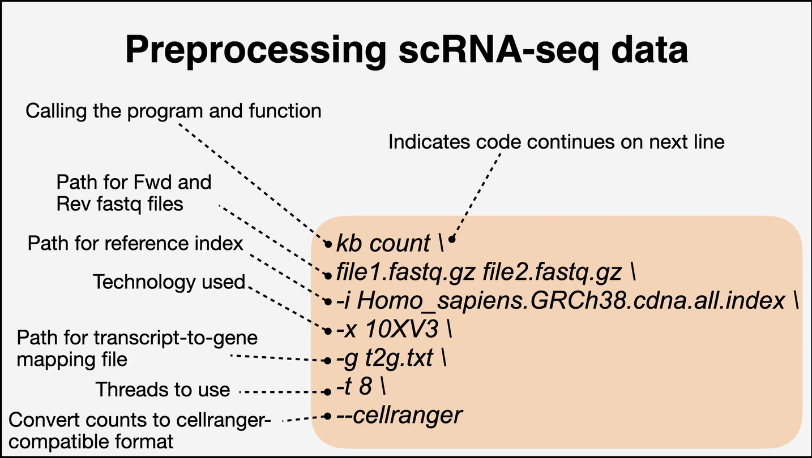

## Credit
Data and code below were taken from the [DIY.transcriptomics](https://diytranscriptomics.com/) course by Dr. Daniel Beiting

## Data

These are the fastq files that come from 1000 peripheral blood mononuclear cells (PBMCs) and is one of the sample datasets provided by 10X Genomics.

Storage space ~ 5Gb

Download [here](https://drive.google.com/drive/folders/1DbLRO4kv-y3W06adFR26RdSaDPmfB4UA)
Note: do not uncompress them.

Get the reference sequences from Ensembl (cDNA fasta file for Human)
[here](https://www.ensembl.org/info/data/ftp/index.html)

(Optional) This file will be generated on the fly but I am anyway pasting the link
here (just in case).
[transcript to gene mapping file](https://diytranscriptomics.com/Code/files/t2g.txt)

## Initial setup and preprocessing (mostly in shell)

1. Create a conda environment (name it sva_demo) and activate it
> conda create --name sva_demo

> conda activate sva_demo

2. Install the Kallisto package (popular for single cell analysis)
> conda install kallisto

3. Install the kb-python package that consist of some bustools required to perform preprocessing of the dataset
> pip install kb-python

More info about kb-python [here](https://www.kallistobus.tools/kb_usage/kb_usage/)

4. Use Kallisto to build index from reference sequences
> kallisto index -i Homo_sapiens.GRCh38.cdna.all.fa Homo_sapiens.GRCh38.cdna.all.index

<i>kallisto index -i input_fasta output_index</i>

5. Preprocessing scRNA-seq data
```
 kb count \
 pbmc_1k_v3_S1_mergedLanes_R1.fastq.gz pbmc_1k_v3_S1_mergedLanes_R2.fastq.gz \
 -i Homo_sapiens.GRCh38.cdna.all.index \
 -x 10XV3 \
 -g t2g.txt \
 -t 8 \
 --cellranger
```


Great, now you are done with the initial setup and preprocessing!

## QA and analysis in RStudio

1. You must have R and RStudio installed. If [not .....](https://rstudio-education.github.io/hopr/starting.html)

2. Now open the DIY_scRNAseq script on your system (Rstudio) and simply follow the instrunctions in it.